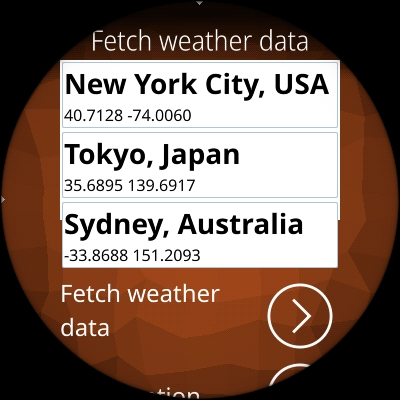
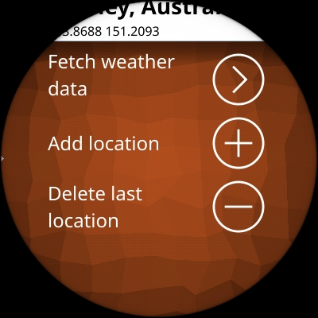

# AsteroidOS Weather Fetch App

This app uses an internet connection from the watch to fetch weather forecast data to be used for the Weather app in [AsteroidOS](http://asteroidos.org/)

## GUI version

The GUI version allows the user to directly enter locations on the watch or manipulate the order by drag-and-drop.



The rest of the GUI screen looks like this:



## Command-line version

There is also a command-line version called `weatherfetch_cli` which is intended to be used from a command line.  On the watch command line as the `ceres` user, one can run the command with no arguments to fetch the weather forecast for the previously configured location.

If the user would like to temporarily add a new location and fetch weather for that location:

```
weatherfetch_cli -cl --add 50.812375,4.380734,"Université libre de Bruxelles"
```

In the following, TOL means Top-Of-List and BOL means Bottom-Of-List.  These refer to the saved location list.  Here are the possible commands


| Short   | Long      | Args          | Description
|---------|-----------|---------------|-----------------------------------------------
| -a      | --add     | lat,lng,name  | add the location to top of list (TOL)
| -c      | --config  |               | manipulate the list but don't fetch weather
| -d      | --delete  |               | delete bottom of list (BOL)
| -l      | --list    |               | list all current locations
| -r      | --rotate  |               | rotate the list to put TOL at BOL

These should always execute in the order `rotate`, `delete`, `add`, `list`, `config` no matter their order on the command line. The (admittedly weak) reasoning for this order is that one can do simple testing with something like this:

```bash
weatherfetch_cli -rdlc --add 50.812375,4.380734,"Université libre de Bruxelles"
```

And the effect is that each time it is run, it will rotate the top entry to the bottom, delete it, add the new entry to the top, and then list the result, all without actually fetching the weather (that's the -c) and annoying or abusing that service during testing.

## Build

First Download and install the SDK as described at [wiki.asteroidos.org](https://wiki.asteroidos.org/index.php/Installing_the_SDK)

Then clone and compile by executing the following commands:

```bash
# Get source distribution
git clone https://github.com/beroset/asteroid-weatherfetch.git
cd asteroid-weatherfetch

# Compile
export CMAKE_PROGRAM_PATH=/usr/local/oecore-x86_64/sysroots/armv7vehf-neon-oe-linux-gnueabi/usr/bin
source /usr/local/oecore-x86_64/environment-setup-armv7vehf-neon-oe-linux-gnueabi
cmake -B build
cmake --build build
```

See [wiki.asteroidos.org](https://wiki.asteroidos.org/index.php/Creating_an_Asteroid_app) for more build instructions

## Install

```bash
# Install distribution to `./build/install`
cmake --install build --prefix build/install

# Install to watch
scp -r build/install/* root@192.168.2.15:/usr/

# Install dependency on the watch (enable ip connection first)
ssh root@192.168.2.15 'install nemo-qml-plugin-notifications'
```

See [wiki.oasteroidos.org](https://wiki.asteroidos.org/index.php/IP_Connection) on how to enable an ip connection.

